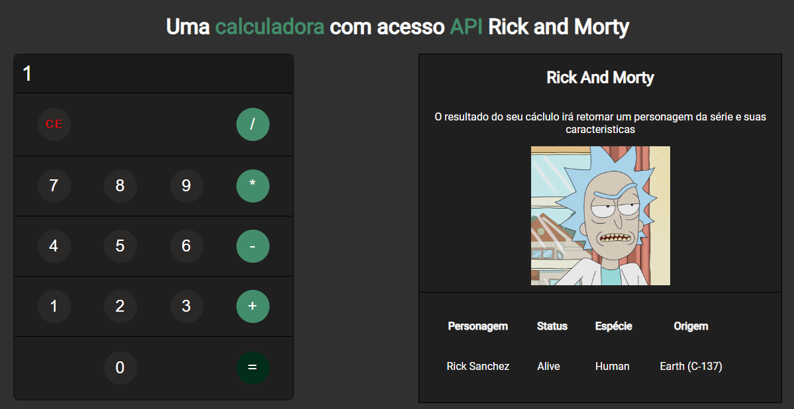

<h1 align="center"> Rick and Morty API </h1>

Projeto de uma calculadora WEB que faz um REQUEST em uma API a partir do resultado do cálculo realizado 

  <a href="#-tecnologias">Tecnologias</a>&nbsp;&nbsp;&nbsp;|&nbsp;&nbsp;&nbsp;
  <a href="#-projeto">Projeto</a>&nbsp;&nbsp;&nbsp;
  

 

  

## 🚀 Tecnologias

Esse projeto foi desenvolvido com as seguintes tecnologias:

- API RESTful
- HTML e CSS
- JavaScript
- jQuery
- Git e Github

## 💻 Projeto

Esse projeto serviu para desenvolver estudos sobre consumo de serviço de API RESTful e método HTTP, bem como explorar a manipulação de elementos HTML com JavaScript.

- [Visite o projeto online](https://gabrielratao.github.io/calculator_rick_morty/)

API utilizada: [The Rick and Morty API](https://rickandmortyapi.com/)

O *endpoint* consumido foi: /api/character/:id

O resultado do cálculo da calculadora é utilizado como parâmetro "id" no REQUEST do serviço da API. A função que realiza o consumo da API utiliza o pacote jQuery.

Ao fazer o REQUEST há um tratamento para eventuais erros que possam ocorrer. Se houver um erro será adicionado um parágrafo avisando que o personagem não existe e a sua imagem retornará para a imagem inicial. 

## 🔖 Manipulação HTML com JavaScript

Para criar a calculadora foram desenvolvidas diversas funções JavaScript para modificar textos dos elementos e identificar seus respectivos valores.

Além disso, optei por inserir um redimensaionamento básico da página caso ela seja acessada em um dispositivo mobile. Foi inserido uma função JS que adapta o dimensionamento dos elementos conforme a largura da tela do usuário.

---

Feito por Gabriel Ratão
- [Linkedin](https://www.linkedin.com/in/gabriel-rat%C3%A3o-33aaa41b1/)